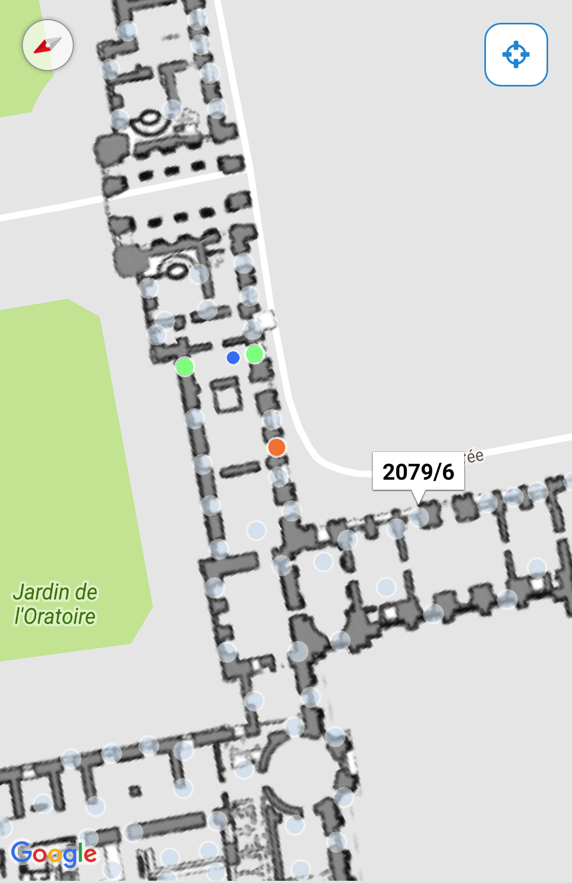

# Android-IndoorLocation-SDK - v2.12.0

**All info regarding adding the `Ubudu Indoor Location SDK` to a host application along with necessary project configuration can be found in the [Wiki](https://github.com/Ubudu/Android-IndoorLocation-SDK/wiki).**

### Library module helpful for ultra fast integration with Google Maps:
https://github.com/Ubudu/GoogleMapsLayout-Android

## Api reference
JavaDoc: [https://github.com/Ubudu/Android-IndoorLocation-SDK/tree/master/JavaDoc](https://github.com/Ubudu/Android-IndoorLocation-SDK/tree/master/JavaDoc)

## Docs

More docs can be found in the Ubudu Knowledge Base website:

[http://community.ubudu.com/help/kb/indoor-location](http://community.ubudu.com/help/kb/indoor-location)

## Authors:

-   MG: Michal Gasztold \<<michal.gasztold@ubudu.com>\>

## Legal status:

Copyright ©2016 Ubudu SAS, All right reserved.
