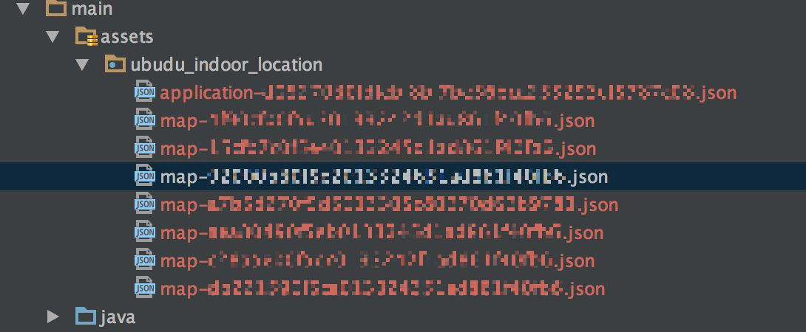
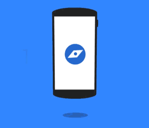

# Android-IndoorLocation-SDK - version 2.6.0

For information on pricing, features, examples and our fantastic iBeacon compatible beacons please check our web-site
[http://www.ubudu.com](http://www.ubudu.com). It is totally free to develop with Ubudu SDKs and we only charge usage... above a certain threshold.

Indoor location provides a solution for mobile devices to estimate their position within an indoor venue. The position is computed in real time and then referenced to the map of the venue. The computation is based on the signal broadcasts received from beacons placed inside the venue as well as on the device's motion measured by available sensors.

To start using Indoor Location SDK in the mobile app an Ubudu Application must be first defined in the [Manager Platform](http://manager.ubudu.com). To create an Indoor Location application please do the following:
   
-   open the `details` of one of the available venues in `Venues & indoor maps ` section or create a new venue and go to its `details` after creating it,

-	click on the blue `Maps` button to go to the chosen venue's map section,

-   click `Add` butoon to start creating new map,

-	configure and save all the map's information according to the map creation tool. For more details please read the following articles:
	-	[Setup indoor map](http://community.ubudu.com/help/kb/indoor-location/setup-indoor-map)
	-	[Geo-referencing indoor map/floor](http://community.ubudu.com/help/kb/indoor-location/geo-referencing-indoor-mapfloor)
	
- 	when your maps are ready go to the `Applications` section,

-	choose one of the applications and edit it,

-	go to the bottom of the edit page till you see `Indoor Location venues` section where you can add available venues to your application,

-	press `Update Application` button to save your changes.


Once the application is ready its namespace uid has to be set in the SDK so it can fetch all data and start indoor positioning.

## Installing

To use the library in an Android Studio project please do the following:

1) add the Ubudu nexus repository url to your build.gradle file:

```
    repositories {
        mavenCentral()
        maven { url 'http://nexus.ubudu.com:8081/nexus/content/groups/public/' }
    }
```

2) then add the following dependency:

```
    dependencies {
        compile('com.ubudu.indoorlocation:ubudu-indoor-location-sdk:2.6.0@aar') {
            transitive = true
        }
        // …
    }
```

A jar file of the SDK is also available in the `/Ubudu-IndoorLocation-SDK` directory of this repository. To use it in your project (e.g. in Eclipse IDE) drop the jar file into the `libs` folder and configure the Java build path to include the library.

## Android application integration

To create an instance of the Indoor Location SDK use the following code: 

	UbuduIndoorLocationSDK mSdk = UbuduIndoorLocationSDK.getSharedInstance(getApplicationContext());

### Setting namespace

Next step is to set the application namespace (the visible uid String is just an example): 

	mSdk.setNamespace("1843291458ae318c504ab93bbd2cdd68a2002cde", new UbuduResultListener() {
        @Override
        public void success() {
            printf("Application data fetched and ready.");
        }

        @Override
        public void error() {
            printf("Application data could not be fetched due to a network error.");
        }
	);

After calling the above method all application's data will be automatically downloaded from the Ubudu Manager Platform and proper callback of the `UbuduResultListener` will be called when finished.

*Note!* In the public demo application available on this repository please add your namespace in the `com.ubudu.sampleapp.ubudu.UbuduManager` class in line 63.

### Embedding application data files

There is an option to embedd the applications data so no internet connection is needed at first launch of the app. This can be done by calling the following method in the `success()` callback of `UbuduResultListener` interface:

	mSdk.exportApplicationDataToExternalStorage();

After calling this method all the data files already fetched from the Ubudu Manager Platform are exported to the external storage of the device (sd card). The data is saved into `ubudu_indoor_location` directory. 

	**NOTE**: To use this feature in your build you need to add the following permission in the  manifest:

	`<uses-permission android:name="android.permission.WRITE_EXTERNAL_STORAGE" />`

	Otherwise the SDK will not be able to write to external storage in which the indoor location application data files are exported. After you get all the files you need the permission and the `mSdk.exportApplicationDataToExternalStorage()` method call can be removed.

The whole folder with the map data files should be moved to your Android Studio project's assets directory:



When the data files are in the right place they can be preloaded into the Ubudu Indoor Location SDK. To do this the other type of `setNamespace` method has to be used:

	mSdk.setNamespace("1843291458ae318c504ab93bbd2cdd68a2002cde", "ubudu_indoor_location", new UbuduResultListener() {
        @Override
        public void success() {
            printf("Application data loaded and ready.");
        }

        @Override
        public void error() {
            printf("Application data could not be loaded.");
        }
	);
	
The 2nd parameter of the method above is the String name of the folder that you placed in your app's assets folder.

The `UbuduIndoorLocationManager` is the object to be used for indoor location configuration and start/stop. Its singleton instance is available after `UbuduIndoorLocationSDK` initialization. 
	
	UbuduIndoorLocationManager mIndoorLocationManager = mSdk.getIndoorLocationManager();
	
Indoor Location SDK uses the delegate pattern to communicate with the application. Your delegate class must implement `com.ubudu.indoorlocation.UbuduIndoorLocationDelegate` interface which contains all the methods that must be handled by the application:

	public class MyIndoorLocationDelegate implements UbuduIndoorLocationDelegate{ ... }
	
The reference to the delegate object must be then set in the indoor location manager so the Indoor Location SDK can call its methods:

	mIndoorLocationManager.setIndoorLocationDelegate(mIndoorLocationDelegate);
	
From this point the SDK can start its work. To start the positioning manager's `start()` method has to be called:

	mIndoorLocationManager.start(new UbuduStartCallback() {
	
                @Override
                public void success() {
                    // SDK started
                }

                @Override
                public void failure() {
                    // SDK start failure
                }

                @Override
                public void restartedAfterContentAutoUpdated() {
                    // SDK restarted after remote data auto-update
                }
                
            });
            	
`success()` callback is called when Indoor Location has been started successfully. Location events will be automatically passed to proper the delegate's methods. 

`failure()` callback is called when Indoor Location could not be started because of the network connection problems or corrupted map json file. 

`restartedAfterContentAutoUpdated()` is called after each content auto update. SDK checks for indoor location application updates periodically (once per day and each application restart).

If SDK should be stopped at some point please call the `stop()` method: 

	mIndoorLocationManager.stop();
	
This stops the bluetooth monitoring related to Ubudu Indoor Location.

## Features

### Ranged beacons notifier

It is possible to receive updates related to the beacons that are being ranged by the device. The returned beacons list will contain only the beacons that have been positioned on the map during its creation in the [Manager Platform](http://manager.ubudu.com).
The `UbuduBeacon` object contains complete information about the beacon like:

- `proximity uuid`, `major`, `minor` identifiers,
- cartesian and geographical (only if the map has been properly georeferenced in the [Manager Platform](http://manager.ubudu.com)) coordinates,
- latest `rssi` value, 
- estimated distance to the beacon,
- Bluetooth device name, mac address,
- calibration tx power (power received 1 meter from the beacon with iPhone 5).

### Automatic service restart

Indoor location SDK works in the background and is restarted automatically after the app has been killed by the user/system or on device boot. The application's object implementing `UbuduIndoorLocationDelegate` must be initialized properly each time Indoor Location SDK is started. The app has to register a receiver with an intent filter for `ACTION_SERVICE_RESTARTED` action that is broadcasted by the SDK service on restart. The receiver can be registered in the app's manifest file:

	<receiver android:name=".ubudu.UbuduServiceRestartedReceiver">
		<intent-filter>
			<action android:name="ACTION_SERVICE_RESTARTED" />
		</intent-filter>
    </receiver>

where `UbuduServiceRestartedReceiver` is just an example class extending `android.content.BroadcastReceiver` that can look like the following:

	public class UbuduServiceRestartedReceiver extends BroadcastReceiver {
	
		private static final String TAG = "UbuduServiceRestartedReceiver";
	
		@Override
		public void onReceive(Context context, Intent intent) {
			// the delegate's instance should be created and then set in the Indoor Location SDK:
			UbuduIndoorLocationSDK mSdk = UbuduIndoorLocationSDK.getSharedInstance(context);
			MyIndoorLocationDelegate mIndoorLocationDelegate = new MyIndoorLocationDelegate();
			UbuduIndoorLocationManager mIndoorLocationManager = mSdk.getIndoorLocationManager();
			mIndoorLocationManager.setIndoorLocationDelegate(mIndoorLocationDelegate);
			// ...
		}
	}

### Displaying the indoor map

#### Tiles

Ubudu Indoor Location provides tiles support for displaying the map configured in the [Manager Platform](http://manager.ubudu.com). To get the current map's tiles base url call the following method:

	mIndoorLocationManager.map().getTilesBaseUrl()
	
The url's template is as follows:

	https://imagesd.ubudu.com/u_maps_tiles/{MAP_UUID}/{z}/{x}/{y}.png

This is the tiles URL in a standard format that is supported e.g. by Google Maps API. For more details please see [this](https://developers.google.com/android/reference/com/google/android/gms/maps/model/TileOverlay).

#### Original map overlay file

The image that has been used to create a map in the [Manager Platform](http://manager.ubudu.com) can be retrieved in the mobile app e.g. for display purposes. It is possible to get an `java.io.InputStream` object with the map image:

	InputStream mapOverlayImageInputStream = mIndoorLocationManager.getCurrentMapOverlayInputStream();

### Compass

The SDK uses built in motion and magnetic field sensors to calculate the compass bearing. To receive bearing updates in the mobile application an `UbuduCompassListener` has to be used:

	mIndoorLocationManager.setCompassListener(new UbuduCompassListener() {
		@Override
		public void azimuthUpdated(float azimuth) {
			// ...
		}
	});
	
Note: The magnetic sensor available in Android devices is not always accurate and demands simple calibration that can be done when the app is running:

1. Tilt your phone forward and back,
2. Move it side to side,
3. And then tilt left and right,
4. You may need to repeat the steps until your compass is calibrated.

	
	
	Image and instructions come from [support.google.com](https://support.google.com/gmm/answer/6145351?hl=en).

## Api reference
[http://www.ubudu.com/docs/android/indoor_location_sdk/index.html](http://www.ubudu.com/docs/android/indoor_location_sdk/index.html)

## Docs

More detailed docs about Indoor Location SDK can be found in the Ubudu Knowledge Base:

[http://community.ubudu.com/help/kb/indoor-location](http://community.ubudu.com/help/kb/indoor-location)

## Authors:

-   MG: Michal Gasztold \<<michal.gasztold@ubudu.com>\>

## Legal status:

Copyright ©2016 Ubudu SAS, All right reserved.
