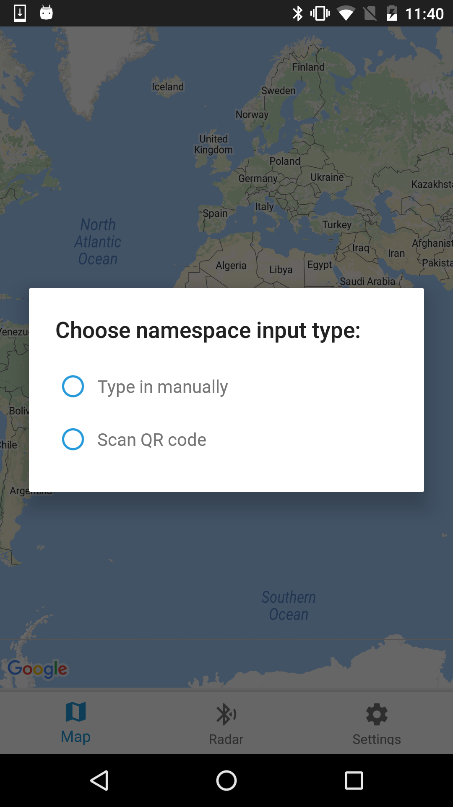
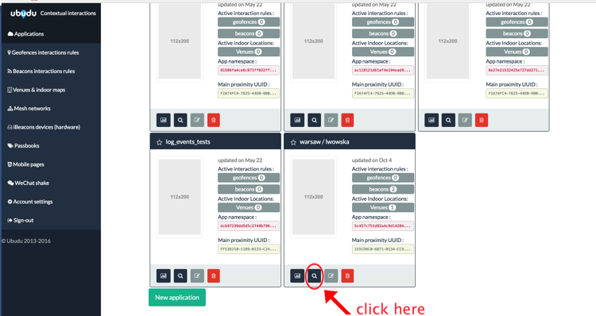
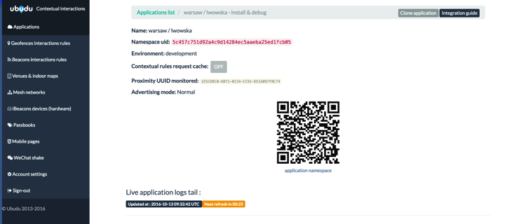

# Sample app

Public Android Studio application sample project is intended to guide the developers through the Ubudu Indoor Location SDK integration on Android device.

At first launch user is asked to provide the `namespace` of the Ubudu application with which the app should work. `namespace` can be typed/pasted manually or provided by scanning the QR code that can be found in Ubudu Manager Platform. 

The navigation to particular application's details within the Ubudu Manager Platform website where the QR code is displayed is presented on the screenshots below:

## Authors:

-   MG: Michal Gasztold \<<michal.gasztold@ubudu.com>\>

## Legal status:

Copyright ©2016 Ubudu SAS, All right reserved.
